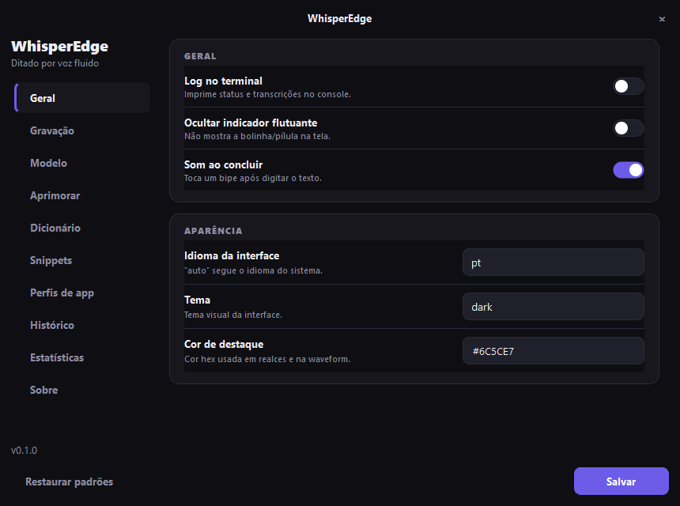

<div align="center">


# WhisperEdge

**Local, private, fluid voice dictation for Windows.**

Speak into any app — the text is typed wherever your cursor is.
Transcription runs 100% on your machine, no cloud required.

[](#-install)
[](#-install)
[](LICENSE)
[](#-privacy)

[Install](#-install) • [Usage](#-usage) • [Features](#-features) • [Português](README.md)



</div>

---

## What is it

WhisperEdge sits invisibly in your system tray listening for a global hotkey
(default `Ctrl + Space`). Press it, speak, pause — and what you said is
**typed automatically** into whatever field you were in. Transcription runs
locally via [faster-whisper](https://github.com/SYSTRAN/faster-whisper):
your audio never leaves your machine.

| Idle | Hover (controls) | Recording |
|:---:|:---:|:---:|
|  |  |  |

The floating dot is **draggable** (remembers its spot) and the waveform
**reacts to your actual voice** — flat in silence, alive when you speak.

## ✨ Features

- 🎙️ **Local, offline dictation** — Whisper models from `tiny` to `large-v3`;
  4 recording modes (voice-activity stop, continuous, press-to-toggle,
  hold-to-record).
- 🌊 **Floating indicator** with a voice-reactive waveform that never steals
  focus from the window you're typing into.
- 📋 **Always on the clipboard** — every transcript is ready to paste even if
  no field was focused.
- 🧹 **AI clean-up** *(optional)* — an LLM fixes punctuation and removes filler
  words. Works with OpenAI, any compatible endpoint, or **local Ollama**.
  Fully switchable off.
- 🎯 **App profiles** — tone adapts to the active app: casual in
  Discord/WhatsApp, well-structured technical prompts in IDEs, formal in email.
- ⌨️ **Command Mode** — a second hotkey: speak an **instruction** about the
  selected text ("summarize this", "make it formal") and it gets rewritten.
- 📖 **Personal dictionary**, ⚡ **voice snippets**, 🕘 **local history**
  (SQLite) and 📊 **usage stats** (words, WPM, daily streak).
- 🌐 **English & Portuguese UI**, dark theme with configurable accent,
  settings applied **without restarting**.

## 🚀 Install

**Requirements:** Windows 10/11, [Python 3.11](https://www.python.org/downloads/)
(check *"Add python.exe to PATH"*), a microphone.

**Option A — standalone exe (no Python needed):** download
**`WhisperEdge-x.x.x-standalone-win64.zip`** from the
[releases page](../../releases/latest), extract, open **`WhisperEdge.exe`**.

**Option B — auto installer (source):** requires Python 3.11 — download the
project and double-click **`install.bat`** (includes optional GPU setup).

**Option C — manual:**

```bash
git clone https://github.com/jonathasmoraes01/WhisperEdge.git
cd WhisperEdge
python -m venv --copies .venv
.venv\Scripts\pip install -r requirements.txt
.venv\Scripts\python run.py
```

> On first run, the transcription model (~460 MB for the default `small`) is
> downloaded once and cached.

Use `WhisperEdge.vbs` to launch with **no window at all**. To start with
Windows, put a shortcut to it in `shell:startup`.

## 🎧 Usage

1. Open WhisperEdge — a small dot appears at the bottom of the screen.
2. Click the field you want to type into.
3. Press **`Ctrl + Space`**, speak, pause.
4. Your words are typed in place (and copied to the clipboard).

Hover the dot for **record / settings / window** controls.

## 🔒 Privacy

- Transcription is **100% local** — audio never leaves your machine.
- History, stats, dictionary and profiles live only in `data/`.
- AI features are **optional and off by default**; with a cloud provider only
  the dictated **text** is sent. With **Ollama**, even that stays local.
- API keys go to `.env`, never into code or config.

## 📜 Credits & license

WhisperEdge is an evolution of the excellent
[**WhisperWriter**](https://github.com/savbell/whisper-writer) by
[sav](https://github.com/savbell) and contributors — thank you! ❤️

Powered by [faster-whisper](https://github.com/SYSTRAN/faster-whisper) /
[CTranslate2](https://github.com/OpenNMT/CTranslate2).

Licensed under **GNU GPL-3.0** — see [LICENSE](LICENSE).
